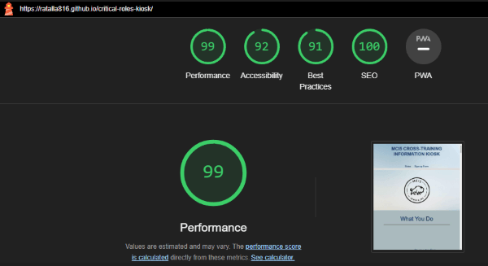
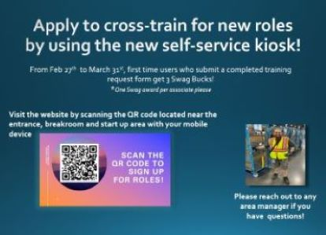

# Critical Roles Kiosk

  
   
   
   
   
  
   
   
   
  
   
  

# Description

## What:
A web application that can be easily accessed by any web-enabled device (phone, computer, tablet, etc) inside or outside of the facility that allows associates to sign up for critical roles training. 

## Why:
The goal is to close all critical role gaps within the next 90 days and create an applicant funnel that can be followed up on later for those that do not currently meet vetting criteria.

## Who:
All tier 1’s may apply.

## How:
The associate scans a QR code located at multiple locations near the entrance, break room, and start up area which brings up the application.
 
The associates are able to review the various critical role descriptions listed on the website. Once they have picked which roles that interest them, they fill out the form on the bottom of the page indicating their login, which roles they want, and their UPT balance. 
 
Once submitted, an email is sent to leadership containing all the information submitted in the form which managers use for vetting.

## When:
Starting on or around February 27th

## Where:
QR code signage located at multiple locations near the entrance, break room, and start up area.
 
  ## Table of Contents
  - [Description](#description)
  - [Deployment](#deployment)
  - [Usage](#usage)
  - [Screenshot](#screenshot)
  - [Features](#features)
  - [Promotion_Collateral](#promotion_collateral)
  - [Acknowledgements](#acknowledgements)
  - [License](#license)
  - [Contact](#contact)

  # Deployment 

  This application is deployed using github pages https://ratalla816.github.io/critical-roles-kiosk

  # Usage

  As a user, I want to: 
  
  * Scan a QR code to open the application on my mobile device

  * Read descriptions and view pictures of the critical role options available to me
  
  * Once I have decided which roles I want to get trained for, I want to send a request form to leadership so I can be vetted for the role  
  

# Screenshot

# Features

* Responsive layout that accommodates smart phones, tablets, desktops and laptops
* Sticky navbar allows users to easily navigate to all sections  
* Optimized performance to provide a quality experience for mobile users
* Detailed descriptions of each critical role option with images
* Embedded third-party submission form with error handling and smooth scroll functionality provided via CDN

 # Promotion_Collateral

 
 

# Acknowledgements

* John Abel and Ali Ewing-Meeler for supporting this project
* Dakota Grey for the great start-up announcements and facilitating a buttery rollout

# License

Copyright (c) 2024 Rob Christopher Atalla

   

Licensed under the Apache License, Version 2.0 (the "License");
you may not use this file except in compliance with the License.
You may obtain a copy of the License at <https://www.apache.org/licenses/LICENSE-2.0>

Unless required by applicable law or agreed to in writing, software
distributed under the License is distributed on an "AS IS" BASIS,
WITHOUT WARRANTIES OR CONDITIONS OF ANY KIND, either express or implied.
See the License for the specific language governing permissions and
limitations under the License.

## Contact:
Holler at me! <a href="mailto:robiatal@amazon.com">robiatal@amazon.com</a>